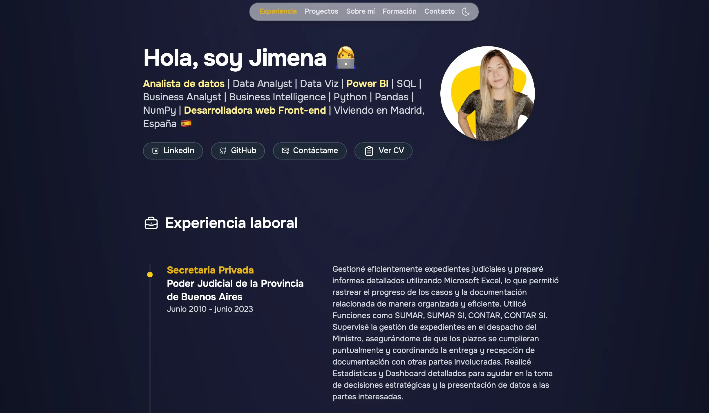

<h3> Hola a todos! 👩‍💻 Este es mi Porfolio  </h3>

Este es el repositorio de mi porfolio personal, diseñado para mostrar mi experiencia como Analista de Datos y Desarrolladora Front-End. El portafolio está construido con Astro y utiliza Tailwind CSS para el diseño y estilo. Es completamente responsivo y está optimizado para adaptarse a diferentes tamaños de pantalla.

### Estructura del Proyecto

El proyecto está dividido en varias secciones clave que destacan diferentes aspectos de mi experiencia y habilidades:

1. Sección de Bienvenida
Contiene un breve saludo y descripción personal.
Incluye una imagen de perfil y enlaces a mis redes sociales.
Implementación responsiva para que la imagen se ajuste adecuadamente en diferentes dispositivos.
2. Experiencia Laboral
Listado de mis experiencias laborales relevantes.
Cada experiencia se muestra en una sola columna, con el título del trabajo, la empresa, la fecha y una descripción detallada.
La línea vertical con el punto amarillo resalta la sección, que se mantiene visible en todos los modos.
3. Proyectos
La sección de proyectos muestran mis trabajos en Python, SQL y Power BI y Páginas Web.
Cada proyecto incluye un título, una breve descripción, tecnologías utilizadas (indicadas mediante badges), y enlaces a GitHub y la presentación del proyecto.
4. Formación Académica
Información sobre mi formación académica y cursos realizados.
Sigue una estructura simple en una columna, con títulos y detalles relevantes.

## Tecnologías Utilizadas

**Astro**: Framework principal para la construcción de la página.
**Tailwind CSS**: Utilizado para el diseño y estilo de la página.
**JavaScript**: Para funcionalidades adicionales y dinámicas.
**HTML5**: Estructura básica del contenido.
**CSS3**: Estilos complementarios.

## Configuración del Proyecto

Clonación del Repositorio:

    git clone https://github.com/JimenaCambronero/portafolio-personal.git
    cd portafolio-personal
    Instalación de Dependencias:
    npm install
    Ejecución del Proyecto:
    npm run dev
Esto iniciará un servidor de desarrollo local donde podrás ver el proyecto en servidor local.

    npm run build
Esto generará los archivos estáticos en la carpeta dist, listos para ser desplegados.

El porfolio está diseñado para ser responsivo:

Las contribuciones son bienvenidas.

# <h4> Si te gusta alguno de los repositorios, podes hacer clic para darme tu apoyo en el ⭐️ botón y correr la voz 🦄⁣ <h4>
⁣ 👩‍💻 Muchas gracias y Saludos!⁣
 
